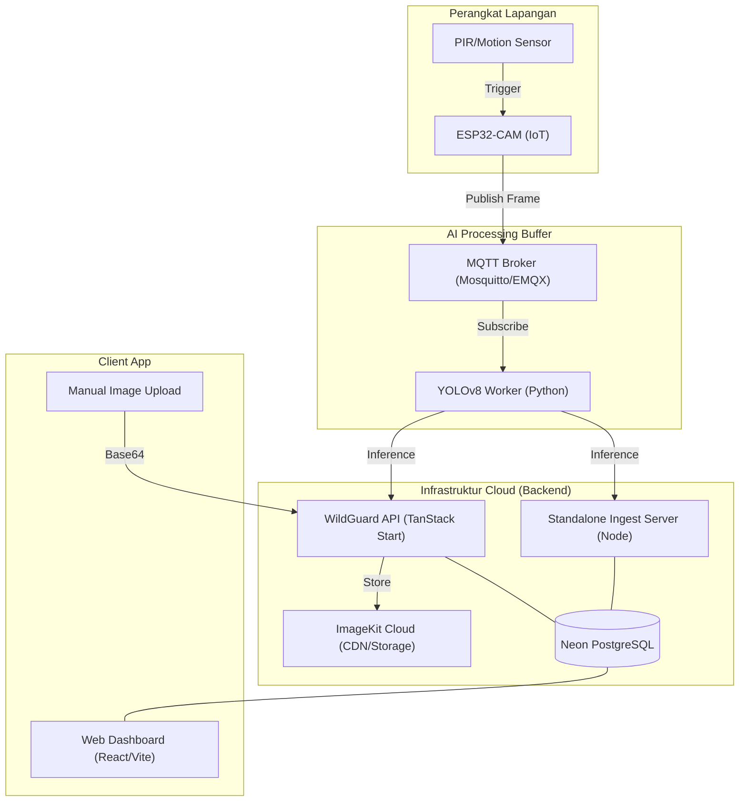
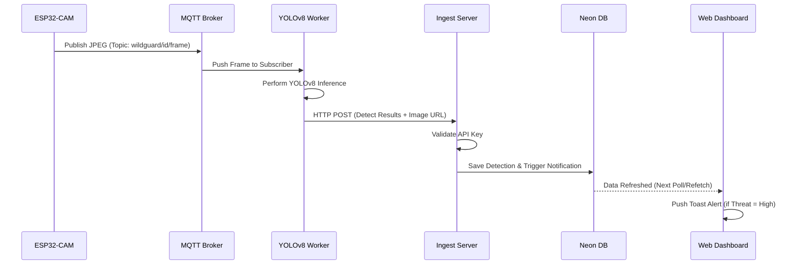
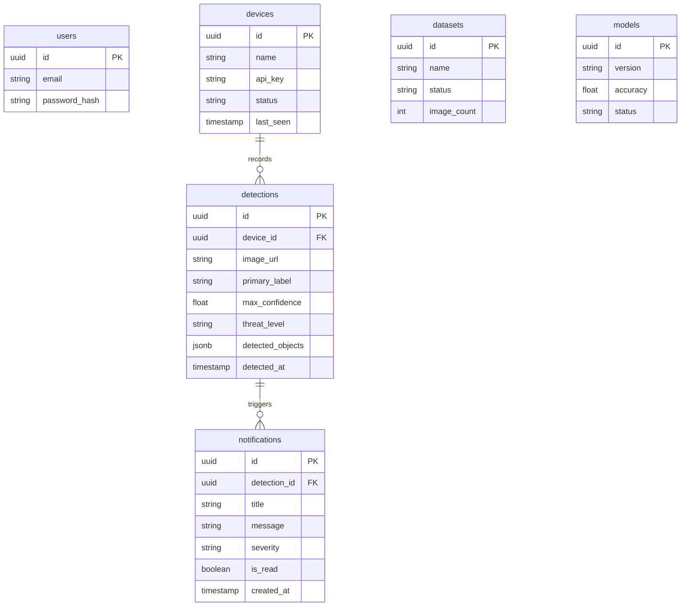
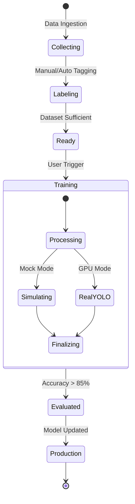

# WildGuard System Documentation 🛡️

WildGuard adalah sistem monitoring satwa liar berbasis IoT yang mengintegrasikan Computer Vision (YOLOv8) dengan infrastruktur cloud modern untuk deteksi ancaman real-time.

---

## 1. Arsitektur Sistem (High-Level)

Sistem ini terdiri dari empat lapisan utama: Perangkat Lapangan (IoT), Pemrosesan AI (Worker), Backend API, dan Frontend Dashboard.

---

## 2. Alur Ingesti Data (Sequence)

Bagaimana sebuah kejadian di hutan sampai ke aplikasi mobile Anda.

---

## 3. Skema Database (ERD)

Struktur data yang disimpan di Neon PostgreSQL.

---

## 4. Siklus Pelatihan ML (State)

Bagaimana dataset diubah menjadi model yang siap pakai.

---

## 5. Konfigurasi Endpoint

- **Frontend**: `http://localhost:8080/`
- **Ingest API (Standalone)**: `http://localhost:8090/ingest`
- **YOLO Worker**: Tergantung konfigurasi `MQTT_HOST`.

> [!NOTE]
> Dokumentasi ini diperbarui secara otomatis seiring dengan perubahan standar teknis WildGuard.
